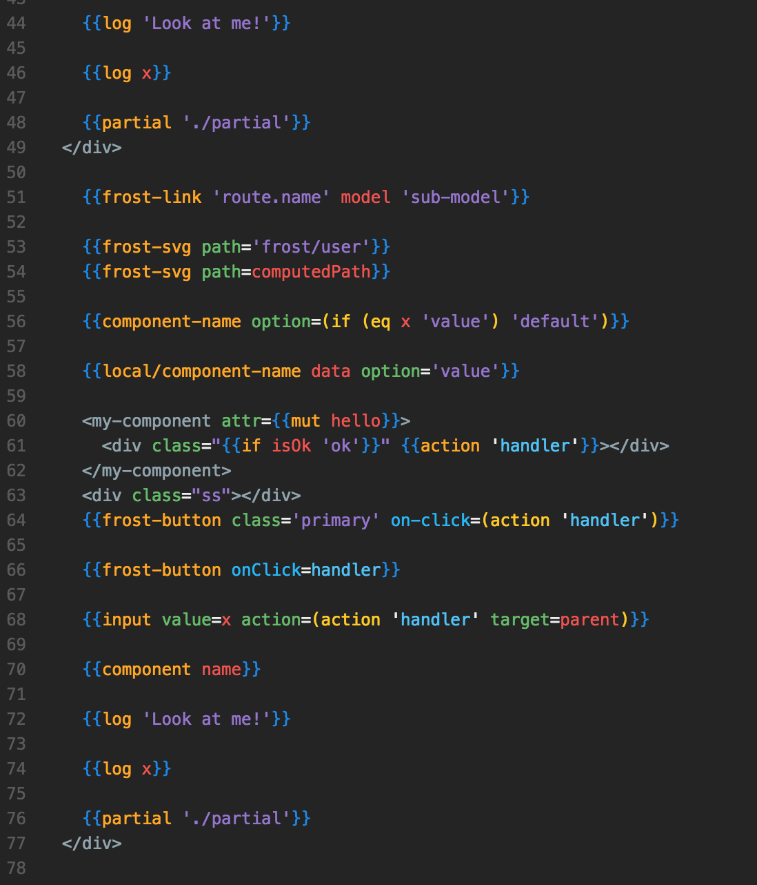

# atom-ember-frost-handlebars-language

Syntax grammar for Ember Handlebars. Consider using the optimized syntax theme for this package: https://github.com/ciena-blueplanet/atom-ember-frost-syntax

## Usage
Change syntax theme to Atom Ember Frost. And handlebars language is set to Handlebars (Ember Frost)

## Theme:
* Handlebars:
	* 
	* 

## Notes:
Be sure to download a Babel package that handles grammar for a good Ember-Atom experience
